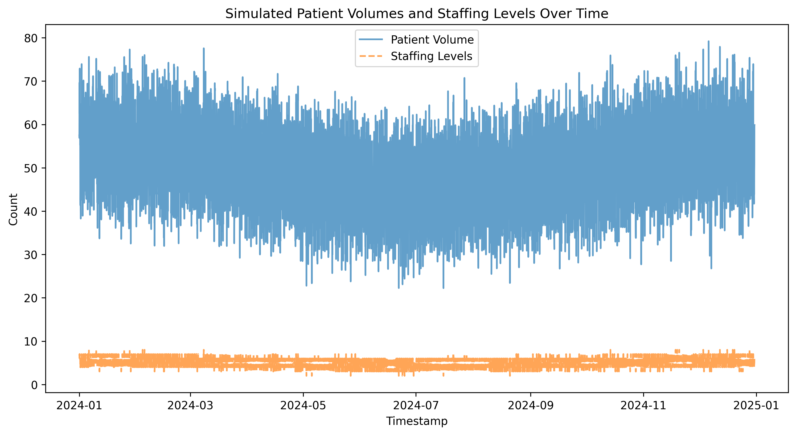
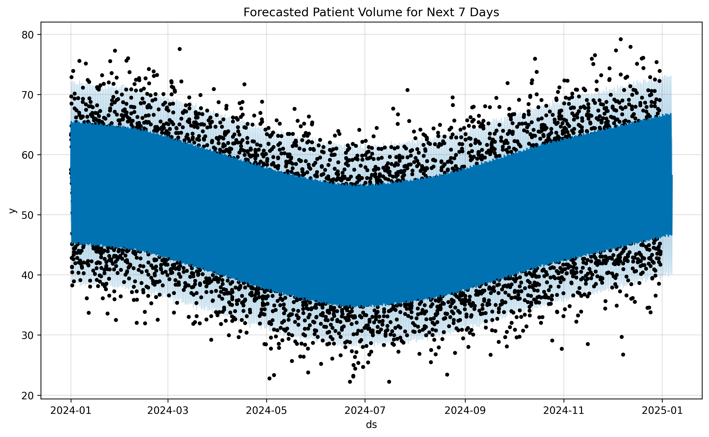
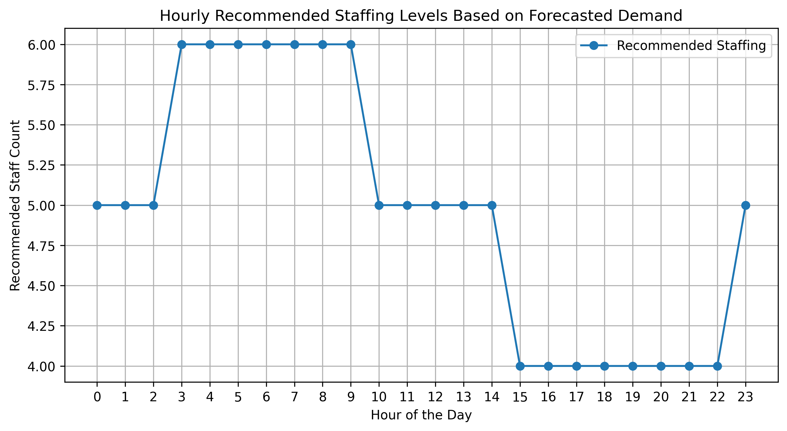
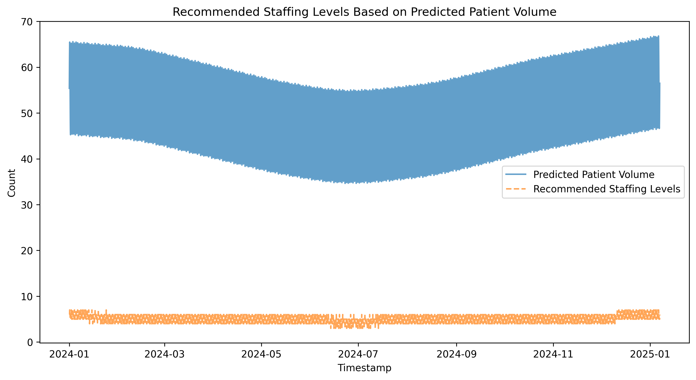

# 🏥 Hospital Staffing Predictor

## 📌 Project Overview
Emergency Departments (EDs) often struggle with unpredictable patient inflows, leading to suboptimal staffing levels. This project uses **time-series forecasting** to predict **future patient volumes** and recommend **optimal staffing levels**. 

By leveraging **Prophet** for forecasting and simulating **real-world patient volume trends**, this tool helps hospitals improve workforce allocation and reduce ED overcrowding.

---

## 🎯 Objectives
- **Simulate Patient Data** 📊: Generate hourly patient volumes and staffing levels.
- **Time-Series Forecasting** ⏳: Predict future patient inflows using **Prophet**.
- **Optimal Staffing Recommendations** 👩‍⚕️: Suggest staffing levels based on predicted demand.
- **Visualization** 📈: Provide meaningful insights through plotted trends.

---

## 📂 Project Structure

---

## 📊 Data Simulation
### **Features in the Dataset**
The dataset consists of **hourly** hospital records over **one year (2024)**:
- **`timestamp`** – Date and hour of each record.
- **`patient_volume`** – Simulated number of patients per hour.
- **`staffing_levels`** – Recommended number of hospital staff.

### **Visualization of Simulated Data**
📌 **Historical Patient Volume & Staffing Levels**


---

## 🔍 Time-Series Analysis
### **📊 Augmented Dickey-Fuller (ADF) Test**
- Checks whether the patient volume data is **stationary** (constant trend over time).
- If **non-stationary**, differencing or other transformations are required.

---

## 📈 Forecasting Future Patient Volumes
- Uses **Prophet** to predict **7-day future trends** in patient visits.
- Forecasts hourly patient inflows based on:
  - **Daily variations** (e.g., peak hours vs. off-peak).
  - **Seasonal trends** (e.g., flu season, holidays).

📌 **Forecasted Patient Volume**


---

## 🏥 Optimal Staffing Level Recommendations
- Uses a **patient-to-staff ratio** of **10:1** to suggest optimal staffing levels.
- Adjusts recommendations based on **predicted patient influx**.

📌 **Recommended Staffing Levels by Hour**


📌 **Recommended Staffing Levels**


---

## 🚀 How to Run the Project
### **1️⃣ Clone the Repository**
```bash
git clone https://github.com/yourusername/hospital_staffing_predictor.git
cd hospital_staffing_predictor
